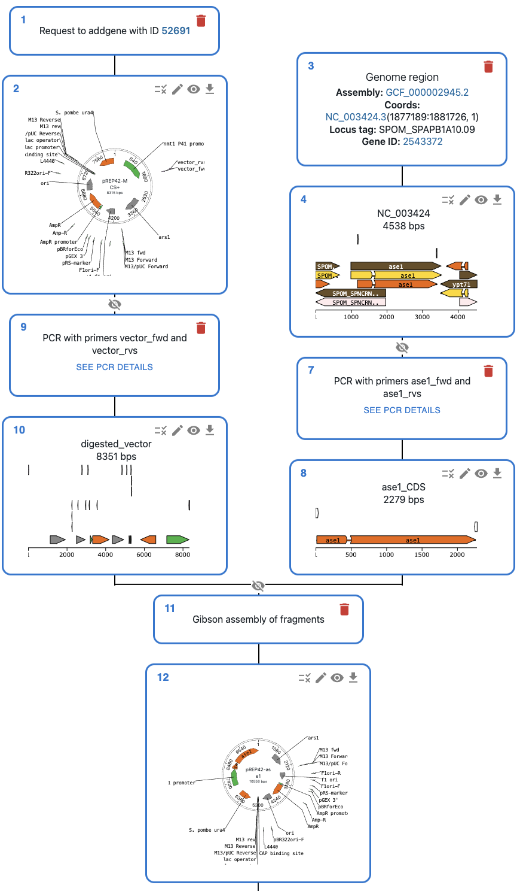

Getting started
==============

.. toctree::
   :maxdepth: 1
   :hidden:

   notebooks/Dseq.ipynb
   notebooks/Dseq_Features.ipynb
   notebooks/Importing_Seqs.ipynb
   notebooks/Restrict_Ligate_Cloning.ipynb
   notebooks/PCR.ipynb
   notebooks/primer_design.ipynb
   notebooks/Gibson.ipynb
   notebooks/CRISPR.ipynb
   notebooks/history.ipynb

The best way to get started is to follow our tutorial notebooks, you can find them in the
repository folder `docs/notebooks <https://github.com/pydna-group/pydna/tree/master/docs/notebooks>`_ and
are reproduced here so they can serve as documentation.

You can run the notebooks locally, but also on the browser using Google Colab, simply click in the badge of
the notebook to open it in Colab.

First steps
----------

We recommend that you first go through the following notebooks, which cover the basics of how sequences are handled in pydna:

1. `Dseq <./notebooks/Dseq.ipynb>`_: Basic introduction to how sequences are handled in pydna.
2. `Dseq_Features <./notebooks/Dseq_Features.ipynb>`_: How to work with sequence features, which are often present in genbank or dna files to mark regions of interest (coding sequences, resistance markers, etc.)
3. `Importing_Seqs <./notebooks/Importing_Seqs.ipynb>`_: How to import sequences from various sources.

Getting started with cloning
----------------------------

Next, you can learn how specific cloning techniques are handled.

* `Restrict_Ligate_Cloning <./notebooks/Restrict_Ligate_Cloning.ipynb>`_: How to perform restriction and ligation.
* `PCR <./notebooks/PCR.ipynb>`_: How to perform PCR.
* `primer_design <./notebooks/primer_design.ipynb>`_: How to design primers for Gibson assembly and restriction-ligation cloning.
* `Gibson <./notebooks/Gibson.ipynb>`_: How to perform Gibson assembly.
* `CRISPR <./notebooks/CRISPR.ipynb>`_: How to perform CRISPR-Cas9 cutting.

Cloning history using OpenCloning
---------------------------------

Pydna uses the `OpenCloning <https://opencloning.org>`_ data model to store the provenance / history of sequences.

You can then visualize that as a graph in the command line:

::

    ╙── product_name (Dseqrecord(o34))
        └─╼ GibsonAssemblySource
            ├─╼ fragment1 (Dseqrecord(-21))
            ├─╼ fragment2 (Dseqrecord(-12))
            └─╼ fragment3 (Dseqrecord(-13))

Or load it into the `OpenCloning <https://opencloning.org>`_ web interface, where you can have a rich
visual representation of the sequences, and plan cloning and primer design using a web interface. See
an example in `this link <https://app.opencloning.org/?source=example&example=homologous_recombination.json>`_.

To see how to use this feature, check the `history notebook <./notebooks/history.html>`_.

More examples
-------------

These notebooks cover the basics, but you can see real-world examples in the `example gallery <./example_gallery.md>`_.
